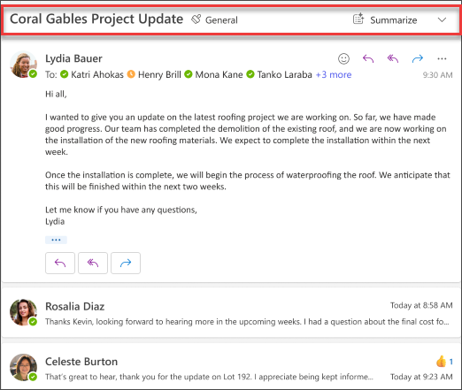

Outlook で Copilot を使用すると、AI を利用した支援によって受信トレイを容易に管理し、メールをすばやく作成し、長いメール スレッドを短い要約に変換することができます。 大規模言語モデル (LLM) の機能と Outlook データを組み合わせて、職場での生産性を維持します。 メール スレッド (会話とも呼ばれます) を要約して、複数のメッセージから重要なポイントを引き出すことができます。

メールのコンテキスト内で **[Copilot で要約]** が選択されている場合、Copilot はスレッドに基づいて自動的に要約を提供します。 一般的なユース ケースでは、長いメールを要約して、どのような決定が行われたか、スレッド上の他のユーザーによって提案されたアクションを確認します。

完了すると、概要がメールの上部に表示され、番号付きの引用も含まれます。この引用を選択すると、スレッド内の対応するメールに移動します。

## 作成方法を見てみましょう

基本的な要約機能を使用する代わりに、ツール バーから Outlook の [Copilot] ペインを開き、指示に従います。 ただし、メールの固有の状況は異なります。状況に合わせてプロンプトを適応させる必要があります。

> [!NOTE]
> 開始プロンプト:
>
> _このメールの会話を要約します。_

この簡単なプロンプトで、_メールのやりとりを要約する_という基本的な**目標**から開始します。 ただし、概要が必要な理由や探しているものに関する情報はありません。

| 要素 | 例 |
| :------ | :------- |
| 基本プロンプト:  **目標**から開始 | **このメールの会話を要約します。** |
| 適切なプロンプト:  **コンテキスト**の追加 | **コンテキスト**を追加すると、Copilot が目的を理解し、それに応じて応答を調整できるようになります。  「_...自分に割り当てられたアクション項目の概要が必要です。_」 |
| 改善したプロンプト:  **ソース**の指定 | **ソース**を追加すると、要約する必要がある部分を Copilot が把握し、より正確な応答ができるようになります。  「_木曜日に送信されたプロジェクト計画から..._」 |
| 最適なプロンプト:  明確な**期待**を設定する | 最後に、 **期待される回答** を追加すると、概要の書式設定方法と必要な詳細レベルをCopilotが理解するのに役立ちます。  「_すべてのアクション項目と割り当てられた所有者を含む表を作成し、自分に割り当てられた項目を強調表示してください。_」 |

> [!NOTE]
> **作成されたプロンプト**:
>
> _このメールのやりとりを要約してください。木曜日に送信されたプロジェクト計画からの自分に割り当てられたアクション項目の概要が必要です。すべてのアクション項目と割り当てられた所有者を含む表を作成し、自分に割り当てられた項目を強調表示してください。_

このプロンプトには**目標**、**コンテキスト**、**ソース**、**期待**があるため、このプロンプトで Copilot が確かな回答を提供するのに必要なすべての情報が提供されます。 

> [!IMPORTANT]
> Outlook の Copilot では、現時点では、職場または学校のアカウントと、outlook.com、hotmail.com、live.com、および msn.com のメール アドレスを使用する Microsoft アカウントのみがサポートされています。 Gmail、Yahoo、iCloud など、サードパーティのメール プロバイダーのアカウントを使用している Microsoft アカウントでも Outlook は使用できますが、Outlook の Copilot 機能にはアクセスできません。 詳細については、「[Outlook で Copilot を使用してメール スレッドを要約する](https://support.microsoft.com/office/summarize-an-email-thread-with-copilot-in-outlook-a79873f2-396b-46dc-b852-7fe5947ab640)」をご覧ください。