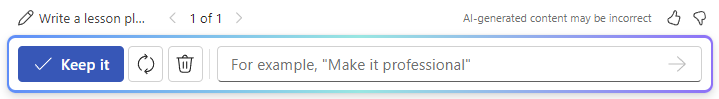

# Word で Microsoft 365 Copilot を使用して、カバーレター、マーケティング計画、およびアウトラインの下書きを作成する

Word で Microsoft 365 Copilot の使用を開始するには、リボンの **[ホーム]** タブで Copilot アイコンを選択するか、文書内で直接書き込みを開始することで、**[Copilot]** ペインを開くことができます。

ドキュメントの本文で直接下書きを開始するには:

1. Microsoft Word 文書を開き、新規の空白文書を開始します。

1. プロンプトを **[Copilot で下書き]** ボックスに入力するか貼り付けます。

1. **[生成]** を選択すると、Copilot は新しいコンテンツの下書きを作成します。

Copilot がコンテンツを生成したら、**[保持]** を選択してコンテンツの保持、**[再生成]** を選択して応答の再生成、**[破棄]** を選択してコンテンツの破棄を行ったり、作成ボックスに「_より簡潔にする_」などの詳細を入力して下書きを微調整したりします。

次の例では、Word の Copilot に対する基本的なプロンプトを、必要なものだけを必要な方法で提供する、適切に構築されたコンテキスト プロンプトに変換します。

## 作成方法を見てみましょう

まず、まだ行っていない場合は、**_[Contoso CipherGuard Product Specification.docx](https://go.microsoft.com/fwlink/?linkid=2269123)_** をダウンロードし、ファイルを **OneDrive フォルダー**に保存します。

Word で文書を開き、リボンの **[ホーム]** タブで **Copilot** アイコンを選択して [Copilot] ウィンドウを開きます。以下のプロンプトを入力し、操作を進めます。

> [!NOTE]
> 開始プロンプト:
>
> _マーケティング提案の下書きを作成してください。_

この簡単なプロンプトで、_新しいマーケティング提案を作成する_という基本的な**目標**から開始します。 しかし、提案の資金提供先が何であるか、誰が関与しているかに関する情報はありません。

| 要素 | 例 |
| :------ | :------- |
| **基本的なプロンプト:** **目標**から開始 | **_マーケティング提案の下書きを作成してください。_** |
| **適切なプロンプト:** **コンテキスト**の追加 | **コンテキスト**を追加すると、作成するドキュメントの種類と使用対象を Copilot が把握できるようになります。 _「...Contoso の最新製品: CipherGuard のために、マーケティング キャンペーンのアイデアを 3 つ生成する必要があります...」_ |
| **プロンプトの改善:** **ソースの指定** | **ソース** を追加すると、Copilot が特定の情報を検索する場所を把握するのに役立ちます。 _「...製品の仕様と要件を使用して。」_ |
| **最適なプロンプト:** 明確な**期待**の設定 | 最後に、**期待**を追加すると、ドキュメントがどのような書式でどのように書かれるのが望まれるのかを Copilot が把握できるようになります。 _「製品の概要、各アイデアの長所と短所、ROI 予測を入れてください。ドキュメントは 2 ページに収め、楽観的で説得力のある言葉を使用してください。」_ 　 |

> [!NOTE]
> **作成されたプロンプト**:
>
> _Contoso の最新製品 CipherGuard のマーケティング提案の下書きを作成してください。製品の仕様と要件を使用して、マーケティング キャンペーンのアイデアを 3 つ生成する必要があります。製品の概要、各アイデアの長所と短所、ROI 予測を入れてください。ドキュメントは 2 ページに収め、楽観的で説得力のある表現を使用してください。_

プロンプトの結果を確認し、質問や改善をフォローアップしてから、新しいセクションでドキュメントの末尾に追加します。 後で使用できるように、ファイルを**保存**します。

このプロンプトでは、**目標**、**コンテキスト**、**ソース**、**期待**など、適切な回答を出すのに必要なすべての情報が Copilot に提供されます。

### ソースの参照

Copilot に既に持っているファイルからの新しいドキュメントを基にさせる場合は、そうするように指示できます。 **[Copilot で下書き]** ダイアログで、**[ファイルを参照]** を選択して、新しいドキュメントの作成時に Copilot が調べる**_ファイルを 3 つまで_** 選択します。

作成ボックスに「/」と参照するファイルの名前を入力して、選択対象のメニューに表示されるファイル オプションを更新することもできます。

> [!IMPORTANT]
> 参照しているファイルにアクセスするには、組織の SharePoint と OneDrive のいずれにあっても、そして Word ファイルと PowerPoint ファイルのいずれであっても、アクセス許可が必要です。

## さらに探索

試してみませんか? 独自のドキュメントとプレゼンテーションで作成したプロンプトを使用します。 その後に試すのをお勧めする他のプロンプトに関するいくつかの提案を次に示します。

- _ワーク/ライフ バランスを確立することの重要性に関する記事を書きます_。

- _プロジェクト管理に関するホワイト ペーパーを書きます_。

- _Contoso の営業職の採用通知書を書きます。開始日は 8 月 1 日で、給与は年間 60,000 ドルとボーナスです_。
