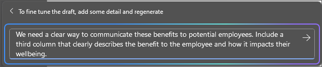

Word の Microsoft 365 Copilot を使用すると、新しいコンテンツの下書き中にアイデアの流れを維持し、アイデアを書き終えた後にコンテンツを変換できます。 Copilot では、トーンの調整など、テキストを書き直すことができます。 Copilot では、テキストを編集可能なテーブルに変換することもできます。 Word でコンテンツを変換するには、次の手順に従います。

## トーンを書き直す

1. Copilot で書き直すテキストを選択します。

1. テキストの横の左余白で、**[Copilot]**  アイコンを選択します。

1. 左余白の [Copilot] メニューで、**[書き直す]** を選択します。

1. Copilot は、書き直したオプションを選択用に表示します。

1. 変更後のテキストを使用するには **[置換]** を選択し、**[下に挿入]** を選択して、現在のテキストの下に書き直されたテキストを挿入するか、**[再生成]** を選択して Copilot の提案を再生成するか、**[トーンの調整]** を選択して書き直されたテキストを希望するトーンに調整します。

    

## テキストをテーブルに変換

1. Copilot でテーブルに変換するテキストを選択します。

1. テキストの横の左余白で、**[Copilot]**  アイコンを選択します。

1. 左余白の [Copilot] メニューから、**[テーブルとして視覚化]** を選択します。

1. Copilot は、テーブルがどのように見えるかを表示します。

1. **[保持]** を選択してテーブルをドキュメントに挿入するか、**[再生成]** を選択して Copilot のテーブルを再生成するか、**[破棄]** を選択してテーブルを削除します。

1. テーブルを微調整するには、詳細を Copilot の作成ボックスに入力して、テーブルに関して変更する内容を示します。

    1. 作成ボックスを使用したテーブルの書式設定の変更はサポートされていませんが、Word リボンのテーブル オプションを使用してテーブルの書式設定を変更できます。

    

次の例では、簡単なプロンプトから始めて、途中でいくつかのテキストをテーブルに変換し、要素を追加します。 自分のデータを使用して、例を進めてください。

## 作成方法を見てみましょう

まず、まだ行っていない場合は、**_[Graphic Design Institute - Employee Benefits.docx](https://go.microsoft.com/fwlink/?linkid=2268825)_** をダウンロードし、ファイルを **OneDrive** フォルダーに保存します。

Word で文書を開き、文書内のすべてのテキストを強調表示します (**Ctrl キーを押しながら A キーを押す**)。 左余白の [Copilot] メニューから、**[テーブルとして視覚化]** を選択します。 テーブルを生成した後、次のプロンプトを使用して Copilot をフォローアップし、結果を絞り込みます。

> [!NOTE]
> 開始プロンプト:
>
> _表として視覚化します。_

この簡単なプロンプトで、_テキストをテーブルに変換する_という基本的な**目標**から開始します。 ただし、テーブルに必要な情報や、テーブルにする必要がある理由は示していません。

| 要素 | 例 |
| :------ | :------- |
| 基本プロンプト:  **目標**から開始 | **_表として視覚化します。_** |
| 適切なプロンプト:  **コンテキスト**の追加 | **コンテキスト**を追加すると、表示するデータの種類と使用対象を Copilot が把握できるようになります。  「_これらの利点を潜在的な従業員に伝えるための明確な方法が必要です。_」 |
| 改善したプロンプト:  **ソース**の指定 | この例の**ソース**は、**Graphic Design Institute - Employee Benefits.docx** のテキスト全体です。 |
| 最適なプロンプト:  明確な**期待**を設定する | 最後に、**期待**を追加すると、テーブルをどのように構成して書き込むか、Copilot が把握できるようになります。  「_3 番目の列を含めます。この列では、従業員にとっての利点と、この利点が従業員のウェルビーイングに及ぼす影響について明確に説明します。_」 |

> [!NOTE]
> **作成されたプロンプト**:
>
> _テーブルとして視覚化します。これらの利点を潜在的な従業員に伝える明確な方法が必要です。3 番目の列を含めます。この列では、従業員にとっての利点と、この利点が従業員のウェルビーイングに及ぼす影響について明確に説明します。_

このプロンプトでは、**目標**、**コンテキスト**、**ソース**、**期待**など、適切な回答を出すのに必要なすべての情報が Copilot に提供されます。

> [!Important]
> この機能は、Microsoft 365 Copilot ライセンスまたは Copilot Pro ライセンスをお持ちのお客様が利用できます。 詳細については、「[Word で Copilot を使用してコンテンツを変換する](https://support.microsoft.com/office/transform-your-content-with-copilot-in-word-923d9763-f896-4da7-8a3f-5b12c3bfc475)」を参照してください。