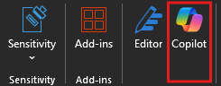
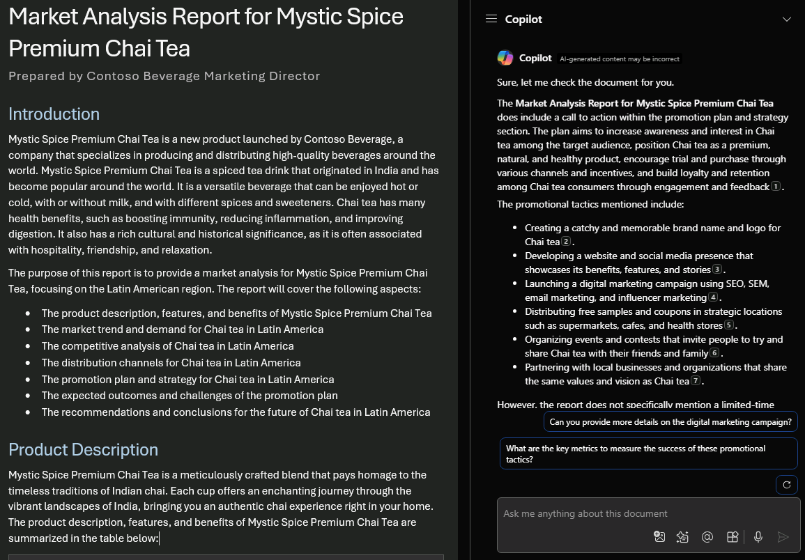

# Microsoft 365 Copilot in Word にヘルプと推奨事項を尋ねる

Word で Copilot とチャットをするには、リボンの **[ホーム]** タブで Copilot アイコンを選択して **[Copilot]** ペインを開きます。

Word の Copilot には、コンテンツの作成やアイデアの生成に加えて、閲覧中のドキュメントに関する質問に答える機能があります。 Copilot がプロンプトに応答すると、Copilot がドキュメント内の情報を取得した場所からの引用を含む参照を表示することもできます。

![最初に開いたときの Word の [Copilot] パネルのスクリーンショット。](../media/ask_copilot-pane-word.png)

## このドキュメントに関する質問

- このドキュメントの概要 - ドキュメントの本質をすばやく把握する必要がありますか? 「このドキュメントを要約」と Copilot チャット ウィンドウに入力すると、ドキュメントが箇条書きで要約されます。

- 行動喚起はありますか? - ドキュメントに有意義な行動喚起が含まれているかどうか疑問に思いますか？ Copilot に質問すると、回答を試みます。

## 自由形式の質問をする

ドキュメントにコンテンツやコンテキストを追加しますか? Copilot に一般的な質問をすると、回答を試みます。 次に例を示します。

- このドキュメントをより学術的に聞こえるように編集するにはどうすればよいですか?

- 米国大統領による勇気に関する名言はありますか?

これらの回答がドキュメントにない場合、Copilot は基礎となる大規模な言語モデルを使用してコンテンツを生成します。 良い情報が見つかりドキュメントに追加したい場合は、Copilot ウィンドウからコピーしてドキュメントに貼り付けるだけです。

## 作成方法を見てみましょう

まず、まだ行っていない場合は、**_[Market Analysis Report for Mystic Spice Premium Chai Tea.docx](https://go.microsoft.com/fwlink/?linkid=2268826)_** をダウンロードし、**OneDrive フォルダー**にファイルを保存します。

Word で文書を開き、リボンの **[ホーム]** タブで **Copilot** アイコンを選択して [Copilot] ウィンドウを開きます。以下のプロンプトを入力し、操作を進めます。

> [!NOTE]
> 開始プロンプト:
>
> _行動喚起はありますか?_

この簡単なプロンプトでは、_"ドキュメント内で意味のある行動喚起を見つける"_ という基本的な**目標**から開始します。 ただし、この情報が必要な_理由_をまだ説明していません。

| 要素 | 例 |
| :------ | :------- |
| **基本的なプロンプト:** **目標**から開始 | **_行動喚起はありますか?_** |
| **適切なプロンプト:** **ソースの指定** | **ソース**を追加すると、Copilot が特定の情報を探すのに役立ちます。 _「...この市場分析レポートでは...」_ |
| **より適切なプロンプト:** **コンテキストの追加** | **コンテキスト**を追加すると、Copilot がコンテキストで応答し、より適切な応答ができるようになります。 _「...課題や懸念事項に対処するには、マーケティング プランにプロモーション プランや期間限定割引など、明確で具体的なアクション プランが含まれているかどうかを確認してください。」_ |
| **最適なプロンプト:** 明確な**期待**の設定 | 最後に、**期待**を追加すると、Copilot が単調に_はい_か_いいえ_で答えるだけではなく、まさに必要なものを把握できるようになります。 _「必要に応じて、行動喚起を改善するための提案を提供してください。」_ |

> [!NOTE]
> **作成されたプロンプト**:
>
> _この市場分析レポートには、課題や懸念事項に対処するための行動喚起はありますか? マーケティング プランにプロモーション プランや期間限定割引など、明確で具体的なアクション プランが含まれているかどうかを確認してください。必要に応じて、行動喚起を改善するための提案を提供してください。_

このプロンプトでは、**目標**、**コンテキスト**、**ソース**、**期待**など、適切な回答を出すのに必要なすべての情報が Copilot に提供されます。

> [!IMPORTANT]
> この機能は、Microsoft 365 Copilot ライセンスまたは Copilot Pro ライセンスをお持ちのお客様が利用できます。 詳細については、「[Word 文書について Copilot とチャットする](https://support.microsoft.com/office/chat-with-copilot-about-your-word-document-4482c688-a495-4571-bfcd-4a9fc6608090)」をご覧ください。
